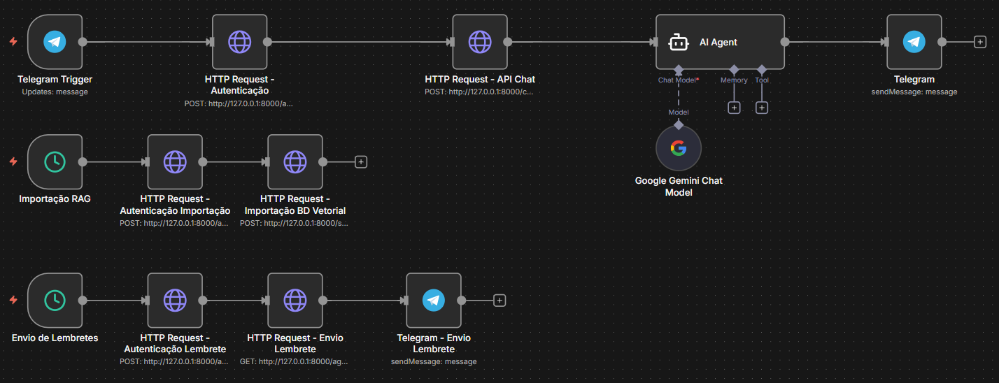

# ARQUITETURA DE UM ASSISTENTE VIRTUAL INTELIGENTE: APLICAÇÃO DE IA COMPORTAMENTAL NO AGENDAMENTO E NA AUTOMAÇÃO ADMINISTRATIVA PARA PROFISSIONAIS AUTÔNOMOS NA ÁREA DE SAÚDE E BEM-ESTAR.

## Índice
* [Objetivo](#objetivo)
* [Escopo e Entregas](#escopo-e-entregas-do-mvp)
* [Contexto](#contexto)
* [Restrições](#restrições-do-mvp)
* [Trade-offs](#trade-offs)
* [C4 Model](#c4-model)
* [Requisitos e Casos de Uso](#requisitos-e-casos-de-uso)
* [Modelagem](#modelagem)
* [Fluxo de Automação (N8N)](#fluxo-de-automação-n8n)
* [Instalação e Infraestrutura](#instalação-e-infraestrutura)
* [Stacks](#stacks)
* [Aplicação Rodando](#aplicação-rodando)

---

## Objetivo
O objetivo do projeto é desenvolver uma solução tecnológica para auxiliar profissionais autônomos da área da saúde, com maior enfoque em psicólogos, a organizar melhor sua rotina. Muitos profissionais perdem tempo com tarefas administrativas, e o sistema foi desenvolvido para automatizar algumas dessas tarefas, permitindo que eles dediquem mais tempo a seus atendimentos.

A solução se trata de um Assistente Virtual Inteligente que funciona pelo Telegram e também por um sistema web. A proposta é que ele seja simples de usar efaça parte do dia a dia do profissional sem trazer a eles maiores complicações.

### Problemas que o sistema resolve
O sistema foi desenvolvido para eliminar problemas comuns na rotina dos profissionais:
* Agenda manual que pode ocasionar erros e horários duplicados
* Comunicação lenta com pacientes para marcar e remarcar consultas
* Falta de lembretes automáticos, o que aumenta atrasos e faltas
* Dificuldades com fusos horários em atendimentos online

### Diferencial: IA Comportamental
Este assistente usa inteligência artificial (IA) para aprender o comportamento de cada paciente e personalizar seu atendimento.
* Sugere horários com base no histórico do paciente
* Envia lembretes mais insistentes para pacientes que frequentemente remarcam ou faltam

### Atendimentos com fuso horário diferente
Quando o paciente está em outro país, o sistema converte automaticamente o horário marcado para o horário do profissional.
Exemplo: o paciente marca às 14h no horário dele e o sistema agenda no horário correspondente no Brasil sem que ninguém precise fazer cálculos.

## Escopo e Entregas do MVP
O projeto segue a abordagem API-First, onde a lógica da aplicação e integrações são desenvolvidas antes da interface.

1. **Coleta e gestão de dados**
   O sistema armazena apenas o essencial, seguindo regras da LGPD. Isso inclui:
   * Dados do paciente, contato e fuso horário
   * Histórico de agendamentos
   * Logs temporários para contexto
   * Configurações do profissional, como horários e serviços

2. **Processamento**
   * O N8N conecta Telegram, API e Google Calendar
   * O Google Gemini interpreta mensagens e gera respostas naturais
   * Um agente em Python analisa o histórico e sugere horários intelige

3. **Interface**

   As telas administrativas foram desenhadas no Figma e já estão finalizadas para posterior desenvolvimento em React.
   * Todas as telas do painel administrativo foram desenhadas e validadas no Figma, focando na usabilidade para o profissional de saúde.

5. **Desenvolvimento**
   * Backend em Python 3.12
   * Banco relacional PostgreSQL
   * Pinecone para armazenamento de vetores e memória contextual

6. **Segurança**
   * Autenticação com JWT
   * Comunicação criptografada em HTTPS
   * Senhas com hash e salt
   * Estrutura compatível com LGPD

7. **Versionamento e Deploy**
   * GitHub para controle de versão
   * Preparado para deploy na AWS

8. **Observabilidade**
   * Logs detalhados.
   * Estrutura pronta para gerar métricas sobre taxas de confirmação e volume de atendimentos.

## Contexto
A demanda por atendimentos online teve um grande aumento e muitos profissionais ainda dependem de processos manuais. Isso gera erros, desencontro de informações, falta de organização e problemas com fusos horários.

Este projeto visa resolver esses problemas oferecendo agendamentos automáticos, lembretes inteligentes e sincronização correta de horários.

## Restrições do MVP
Para a primeira versão (MVP) do projeto, foram definidas as seguintes delimitações:
* Integração apenas com Telegram
* Foco em profissionais individuais e não grandes clínicas
* Não terá pagamentos integrados inicialmente
* Gestão via navegador e não por aplicativo próprio

## Trade-offs
As escolhas tecnológicas foram baseadas no equilíbrio entre robustez, tempo de desenvolvimento e capacidades de IA:

* O N8N foi escolhido para acelerar integrações e evitar código repetitivo
* O backend será totalmente desenvolvido em Python para reduzir complexidade e facilitar integração com IA
* O PostgreSQL foi escolhido para garantir consistência nos dados de agendamentos

## C4 Model
A arquitetura do sistema foi documentada utilizando o modelo C4 para garantir clareza na estrutura.

1. **Contexto:** O assistente de IA conecta pacientes no Telegram, profissionais no sistema web e serviços externos como Google Calendar.
2. **Contêineres:**
    * *Chatbot:* Interface de entrada.
    * *Agente de IA:* Cérebro da operação (Lógica comportamental).
    * *API RESTful:* Regras de negócio e persistência.
    * *Aplicação Web:* Frontend para configuração.
    * *Banco de dados:* PostgreSQL.
3. **Componentes:** Controllers de agendamento, usuários e consultas. IA com módulos de agendamento e análise comportamental.

## Requisitos e Casos de Uso
O sistema foi projetado para atender aos seguintes requisitos principais:

* **RF01 - Chatbot:** Interação via Telegram para agendamentos.
* **RF03 - Lembretes Inteligentes:** Envio automático considerando o padrão de comportamento do paciente (ex: pacientes que faltam muito recebem lembretes antecipados).
* **RF04 - Agendamento Inteligente:** Sugestão de horários baseada no histórico.
* **RF05 - Gestão de Fuso Horário:** Identificação da localização via interação direta com o paciente, com armazenamento temporário da confirmação em memória (cache de 24h) para evitar repetições desnecessárias e garantir a conversão correta dos horários.
* **RF06 - Gestão Administrativa:** Painel para cadastro de horários, valores e serviços.

> [!NOTE]
> *Aqui serão inseridos os links para os diagramas de casos de uso.*

## Modelagem
A solução segue uma arquitetura em camadas utilizando o padrão MVC (Model-View-Controller) no sistema web.

* **Backend:** API em Python.
* **Frontend:** Frontend em React.
* **Fluxo de Dados:** Interpretação de intenção via Gemini e validação de dados via API.

## Fluxo de Automação (N8N)
Para orquestrar as tarefas, como o processamento de mensagens do Telegram, a sincronização com o banco de dados vetorial Pinecone e o envio de lembretes aos pacientes, foi utilizado o n8n. A imagem abaixo demonstra o fluxo implementado:



O Fluxo possuí três gatilhos principais:
1.  **Telegram Trigger**: Inicia o fluxo de chat com o agente de IA sempre que uma nova mensagem é recebida.
2.  **Importação RAG**: Um gatilho agendado (`ScheduleTrigger`) que executa a importação para o banco de dados vetorial periodicamente.
3.  **Envio de Lembretes**: Outro gatilho agendado que verifica e envia lembretes de agendamentos pendentes.

## Instalação e Infraestrutura
> *Nota: Instruções para ambiente de desenvolvimento.*

**Pré-requisitos de Ambiente:**
* Node.js (v20.19.0) & NPM (para o Frontend React).
* Python 3.x para IA e API.
* Docker para rodar N8N e banco.
* PostgreSQL.

1. **Execução da API**
Para iniciar o servidor de desenvolvimento localmente, execute o seguinte comando na raiz do projeto:
```bash
pip install -r requirements.txt
uvicorn app.main:app --reload
```

2. **Configuração do N8N:**
Para configurar os fluxos de automação, siga as opções abaixo:
* **Opção Local (Self-hosted):** Clonar o projeto e executá-lo localmente via Docker ou npm. ([Repositório GitHub](https://github.com/n8n-io/n8n))
```bash
npm install
npx n8n@latest start --tunnel
```
* **Opção Cloud:** Criar uma conta diretamente no site oficial da plataforma. ([n8n.io](https://n8n.io/))

Após acessar o painel do n8n, idependente da opção, é necessário importar o gluxo de trabalho (workflow), baixe o arquivo ([TCC N8N](https://github.com/GustavoStorch/tcc_api_ia/blob/main/docs/TCC%20copy.json)) disponivel no repositório.

## Stacks
* Python e JavaScript/TypeScript.
* React no frontend.
* PostgreSQL e Pinecone.
* Google Gemini e N8N.
* VS Code, Figma, GitHub e Postman.

## Aplicação Rodando

Como não foi possível deixar o assistente virtual disponível online devido à falta de créditos na AWS, estou disponibilizando o vídeo abaixo como demonstração do funcionamento do assistente em suas principais tarefas:

**[Clique aqui para ver a demonstração do Assistente Virtual](https://youtu.be/WPJWmOYrGkU)**

